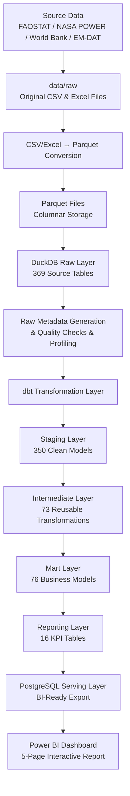
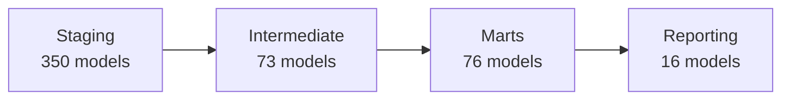
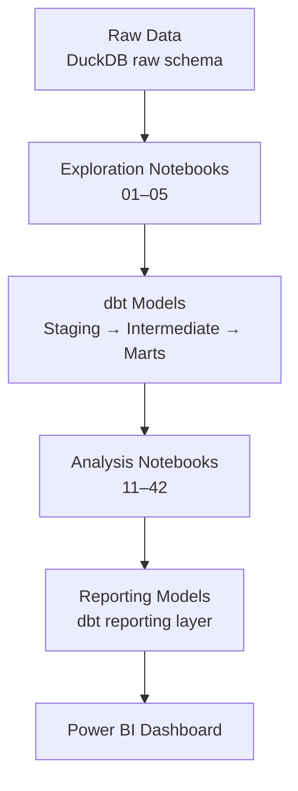
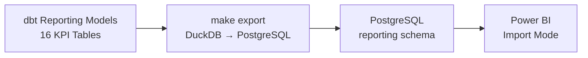

# 01 Architecture Report

# Global Agriculture Market Intelligence Platform

---

## 1. Architecture Overview

The Global Agriculture Market Intelligence Platform is a layered data engineering system designed to transform raw agricultural data from multiple international sources into actionable business intelligence. The platform covers 20 years of global agricultural, trade, food security, and commodity price data (2001–2020) and serves four core business problems: Food Security, Agricultural Productivity, Trade Intelligence, and Commodity Market Analysis.

The architecture follows a medallion-style data lakehouse pattern where data flows through progressively refined layers — from raw ingestion to business-ready reporting — with each layer having a clear responsibility and boundary. The system is built around a small, focused technology stack: DuckDB for analytical storage, dbt for transformation, Python for automation and data acquisition, PostgreSQL as the BI serving layer, and Power BI for dashboard visualization. Execution is driven by a Makefile-based command system, and all transformation logic is centralized in dbt, ensuring reproducibility and auditability.

### End-to-End Architecture Flow

The platform moves data from source acquisition through to dashboard consumption in a strictly sequential pipeline. Each stage produces validated outputs that the next stage depends on, and no layer is skipped or bypassed.



The end-to-end flow ensures that raw data is never directly consumed by downstream systems, that all business logic is version-controlled inside dbt, and that the BI layer (Power BI) only ever interacts with a dedicated, lightweight serving database (PostgreSQL). This separation of concerns is a core architectural principle that keeps each layer independent, testable, and maintainable.

---

## 2. Technology Stack

The platform uses a deliberate, minimal technology stack. Each technology was chosen for a specific role in the architecture, and no technology overlaps with another in its primary responsibility.

### Data Storage: DuckDB

DuckDB serves as the platform's analytical database. It is an in-process, columnar SQL database designed for analytical workloads. DuckDB was chosen because it provides serverless operation (no separate database process to manage), native Parquet support for fast ingestion, excellent performance on analytical queries over large datasets, and zero-configuration embedded execution that simplifies the development workflow. All raw, staging, intermediate, mart, and reporting models are stored in DuckDB schemas during the transformation pipeline. The database also hosts the `audit` schema for data quality tracking and the `metadata` schema for auto-generated table and column documentation.

### Transformation: dbt

dbt (data build tool) is the platform's transformation engine. It is responsible for all SQL-based data modeling, from cleaning raw data in staging to computing final KPIs in reporting. dbt was chosen because it provides version-controlled, testable SQL transformations; automatic dependency management and directed acyclic graph (DAG) execution; built-in testing (not null, unique, relationships, accepted values); and documentation generation from model and schema YAML files. Every transformation in the platform — from column renaming to complex business logic — is implemented as a dbt model, ensuring that no transformation logic lives outside the version-controlled codebase.

### Programming / Automation: Python

Python is used for all non-SQL automation in the platform. This includes data acquisition scripts (downloading weather data from NASA POWER, generating holiday calendars), file format conversion (CSV/Excel to Parquet), data ingestion into DuckDB, raw data quality checks and profiling, metadata generation, and dbt model generation scripts. Python was chosen because it provides rich libraries for data processing (pandas, DuckDB's Python API), direct integration with DuckDB's embedded engine, and flexibility for scripting the full pipeline from source acquisition to export.

### Programming / Automation: Makefile

The Makefile is the platform's command orchestrator. It defines the execution sequence for the entire pipeline, from data acquisition through to documentation generation. The Makefile was chosen because it provides a declarative, dependency-aware command system; a single entry point for all pipeline operations (`make convert`, `make ingest`, `make export`, etc.); reproducible execution sequences that can be run by any team member; and clear documentation of the pipeline steps through make targets. The Makefile does not replace dbt for transformation logic — it orchestrates the steps that run before and after dbt, as well as the dbt execution itself.

### BI: Power BI

Power BI is the platform's visualization and consumption layer. It connects to the PostgreSQL serving database in Import mode and renders five dashboard pages (Overview, Food Security, Agricultural Productivity, Trade Intelligence, and Commodity Market Analysis). Power BI was chosen because it provides rich interactive visualization capabilities, native PostgreSQL connector support, and wide adoption in business intelligence environments. Critically, Power BI does not perform any computation — all KPIs, aggregations, and rankings are pre-calculated in dbt reporting models and served as ready-to-display tables through PostgreSQL.

### Serving Database: PostgreSQL

PostgreSQL serves as the BI serving layer. Reporting tables produced by dbt are exported from DuckDB into PostgreSQL using `make export`, and Power BI connects exclusively to PostgreSQL's `reporting` schema. PostgreSQL was chosen because it provides a stable, production-grade serving database that decouples the BI layer from the analytical engine; reliable connection support for Power BI (which does not natively support DuckDB as a data source); and a lightweight, purpose-built serving layer that contains only the 16 pre-aggregated reporting tables. This separation ensures that dashboard performance is not affected by analytical workloads running against DuckDB.

---

## 3. Data Platform Architecture

The platform is organized into five distinct data layers, each with a clear responsibility and boundary. Data flows strictly downward through the layers — no layer references a layer above it, and each layer only consumes output from the layer immediately before it.

### Raw Layer

The raw layer is the platform's data lake. It stores all source datasets in their original form, preserving the exact structure and content delivered by external data providers. No business transformations, filtering, or enrichment are applied at this stage — the raw layer exists to provide a complete, auditable record of what the platform received from each source.

Source datasets are acquired from FAOSTAT (agricultural production, trade, food balance, land use, emissions, prices, and socioeconomic indicators), NASA POWER (rainfall and temperature time series), the World Bank Pink Sheet (commodity and fuel prices), and EM-DAT (natural disaster records). Additional datasets are generated programmatically: holiday calendars are produced by `make generate-holidays` and weather data is downloaded by `make download-weather`.

All source files are placed under `data/raw` in their original CSV and Excel formats. The `make convert` command converts these files into Parquet format for efficient columnar storage and faster analytical reads. The `make ingest` command then loads the Parquet files into DuckDB's `raw` schema, creating 369 source tables. This schema preserves the original column names, data types, and structures from the source files.

The raw layer also serves as the foundation for data quality validation. After ingestion, three Makefile commands validate the raw data: `make auto-metadata` generates table and column metadata, `make quality-checks-raw` runs row count validation, duplicate detection, null analysis, and consistency checks, and `make profiling-raw` generates column statistics, data distributions, and outlier detection. The results of these checks are stored in DuckDB's `audit` schema and in JSON files under `logs/raw/data_quality/` and `logs/raw/profiling/`.

### Staging Layer

The staging layer is the first transformation layer. Its purpose is to clean source data and standardize it into a consistent, analysis-ready format without introducing any business logic. Every raw table has a corresponding staging model that performs a focused set of mechanical transformations.

Staging models handle column name standardization (converting source-specific naming conventions into a consistent snake_case format), data type preparation (casting VARCHAR columns to their correct numeric or date types, handling NULL values), and basic cleaning operations (removing fully duplicate rows, trimming whitespace, normalizing flag columns). The staging layer also includes specialized sub-layers: a `_dedup` sub-layer for tables known to contain duplicate records (such as `foodbalancesheets_areacodes` and `forestry_trade_flows_areacodes`), and an `_unpivot` sub-layer for datasets provided in wide format with years as columns (such as `trade_matrix` and `commodity_prices`), which are converted into long analytical format suitable for time-series analysis and joins.

The staging layer contains 350 models. No business logic is applied here — the staging layer's responsibility is strictly to produce clean, well-typed, consistently structured datasets that downstream layers can rely on without needing to handle source-specific quirks.

### Intermediate Layer

The intermediate layer contains reusable transformation logic that is shared across multiple downstream mart models. Its purpose is to avoid duplicating complex joins and data preparation logic across the mart layer, and to provide building blocks that can be composed into business-oriented models.

Intermediate models perform complex joins across multiple staging models (for example, joining production data with population data for per-capita calculations), data reshaping operations (pivoting, unpivoting, and aggregating staged data into intermediate analytical shapes), and shared preparation logic (such as calculating base-year indices, computing year-over-year changes, or building country reference mappings). Because intermediate models are designed for reuse, they are not organized around business questions — they are organized around technical operations that multiple marts need.

The intermediate layer contains 73 models. Each intermediate model is a building block that one or more mart models depend on, and the dependency graph is managed automatically by dbt's DAG.

### Mart Layer

The mart layer is where business-oriented analytical models live. Mart models are organized around the platform's four core business domains, and each model represents a business entity or analytical fact that is ready for analysis.

The mart layer contains 76 models organized into the following domain sub-directories:

| Domain | Sub-Directory | Example Models |
|---|---|---|
| Food Security | `marts/food_security` | `fact_food_security__data`, `fact_food_security__foodbalancesheets`, `fact_food_security__historic` |
| Agricultural Productivity | `marts/production`, `marts/land_resources` | `fact_production__crops_livestock`, `fact_land_resources__inputs_fertilizersnutrient`, `fact_land_resources__environment_pesticides` |
| Trade Intelligence | `marts/trade` | `fact_trade__trade`, `fact_trade__matrix`, `fact_trade__fertilizers_detailedtradematrix` |
| Commodity Market Analysis | `marts/prices`, `marts/commodity_prices` | `fact_prices__consumerpriceindices`, `fact_prices__rate`, `dim_commodity_prices__prices`, `dim_commodity_prices__indices` |

In addition to the four core business domains, the mart layer also includes supporting domain models: `commodity_balances`, `country_reference`, `disasters`, `emissions_environment`, `forestry`, `holidays`, `investment_finance`, `research_capacity`, `socioeconomic`, and `weather`. These models provide context, dimensions, and supplementary data that enrich the core analytical models.

Mart models represent the "analysis-ready" version of the data — they are joined, filtered, and organized around business entities such as country, year, commodity, and indicator. Analysts can query mart models directly to answer business questions, and the reporting layer is built exclusively on top of mart models.

### Reporting Layer

The reporting layer produces dashboard-ready datasets that are consumed by Power BI. Its purpose is to take mart-layer data and simplify, aggregate, and shape it specifically for BI consumption — computing the exact KPIs, trend comparisons, and country rankings that the dashboard needs.

The reporting layer contains 16 models, each prefixed with `kpi_` and organized by business domain:

| Domain | Reporting Models |
|---|---|
| Food Security | `kpi_food_security_adequacy_ratio`, `kpi_food_security_below_threshold`, `kpi_food_security_risk_trend`, `kpi_food_security_undernourishment` |
| Agricultural Productivity | `kpi_productivity_wheat_yield`, `kpi_productivity_yield_trend`, `kpi_productivity_fertilizer_intensity`, `kpi_productivity_pesticide_intensity` |
| Trade Intelligence | `kpi_trade_import_dependency`, `kpi_trade_export_concentration`, `kpi_trade_import_diversification`, `kpi_trade_dependency_trend` |
| Commodity Market Analysis | `kpi_prices_volatility`, `kpi_prices_index`, `kpi_prices_cpi_passthrough`, `kpi_prices_fx_effect` |

The reporting layer's responsibilities include KPI calculations (computing metrics such as undernourishment exposure, yield trend percentage change, import dependency ratio, and price volatility), aggregations (averaging across countries, computing population-weighted vs. simple averages, calculating global trend lines), ranking calculations (top/bottom 10 countries by metric change, countries above or below thresholds), and trend preparation (2001 vs. 2020 comparisons, year-over-year percentage changes, indexed trend lines). All of these computations are performed in dbt before reaching Power BI, which ensures that the dashboard's role is strictly visualization and interaction, not computation.

Reporting tables are created specifically for Power BI consumption. They are exported to PostgreSQL using `make export` and loaded into Power BI in Import mode. This means Power BI never needs to perform heavy aggregation at query time, and all business logic is centralized, version-controlled, and independently testable.

---

## 4. dbt Architecture

The dbt project is the platform's transformation engine. It is organized into four model layers that mirror the data platform architecture, with a strict dependency flow from staging through to reporting.

### Model Organization

```
models/
├── staging/
│   ├── _dedup/
│   └── _unpivot/
├── intermediate/
├── marts/
│   ├── commodity_balances/
│   ├── commodity_prices/
│   ├── country_reference/
│   ├── disasters/
│   ├── emissions_environment/
│   ├── food_security/
│   ├── forestry/
│   ├── holidays/
│   ├── investment_finance/
│   ├── land_resources/
│   ├── prices/
│   ├── production/
│   ├── research_capacity/
│   ├── socioeconomic/
│   ├── trade/
│   └── weather/
└── reporting/
```

### Layer Purpose

**Staging** models clean and standardize raw source data. Each raw table has a corresponding staging model that handles column renaming, type casting, and basic cleaning. The `_dedup` sub-directory contains models that isolate duplicate-handling logic for tables with known duplicate issues. The `_unpivot` sub-directory contains models that convert wide-format datasets (years as columns) into long analytical format.

**Intermediate** models contain reusable transformation logic. They combine multiple staging models through joins, apply shared calculations, and prepare data structures that multiple downstream marts depend on. Intermediate models are not organized around business questions — they exist to prevent duplicated logic across the mart layer.

**Mart** models are organized around business domains. Each sub-directory represents a subject area (food security, trade, production, etc.) and contains fact and dimension tables that are ready for analytical queries. Mart models are the primary interface for data analysts and the foundation for all reporting models.

**Reporting** models are the final output layer. They consume mart models and produce the 16 pre-aggregated KPI tables that Power BI displays. Reporting models contain all business logic for KPI calculations, trend comparisons, and country rankings.

### Dependency Flow



The dependency flow is strictly unidirectional: staging models reference raw sources, intermediate models reference staging models, mart models reference intermediate and staging models, and reporting models reference mart models. No model references a layer above it. This ensures that changes to downstream models never break upstream dependencies, and that the transformation DAG remains acyclic.

### Testing Approach

dbt tests are applied at every layer to validate data quality and model correctness:

| Test Type | Purpose | Layers Applied |
|---|---|---|
| `not_null` | Ensures critical columns never contain NULL values | All layers |
| `unique` | Ensures key columns have no duplicate values | All layers |
| `relationships` | Validates foreign key relationships between models | Marts, Intermediate |
| `accepted_values` | Ensures column values fall within expected sets | Staging, Marts |
| `dbt_utils.accepted_range` | Validates numeric values fall within expected ranges | Staging (unpivot) |

Tests are executed layer by layer during the pipeline: `dbt test --select staging` after staging, `dbt test --select intermediate` after intermediate, and `dbt test --select marts` after marts. The reporting layer is not separately tested because its logic is validated through KPI analysis notebooks and cross-checked against the mart layer.

### Source Configuration

dbt source definitions are generated automatically using `make generate-sources-yml`, which creates a `sources.yml` file based on the tables present in the DuckDB `raw` schema. This enables dbt lineage tracking, source freshness checks, and proper model documentation without requiring manual source definition for each of the 369 raw tables.

---

## 5. Notebook Architecture

Notebooks are part of the platform's analytical development architecture, but they are not part of the production pipeline. They serve as an exploratory and validation layer that supports the development of dbt models and the verification of business logic before it is finalized in reporting models.

### Notebook Purpose

Notebooks are used for five primary activities: exploration (understanding raw data structures, coverage, and quality issues), validation (confirming that dbt models produce correct results), business analysis (investigating business questions and framing KPI definitions), KPI investigation (calculating, testing, and refining KPI formulas before they are implemented in dbt), and insight generation (producing the findings that appear in the Business Insights Report). Notebooks do not directly feed Power BI or write to the reporting layer — validated analytical logic is always implemented in dbt reporting models to ensure reproducibility and consistency.

### Notebook Groups

The notebook directory contains two groups organized by their role in the development workflow:

**Notebooks 01–05: Raw Data Exploration**

These notebooks are used early in the pipeline, after raw data preparation, to understand dataset structures, available indicators, data coverage, data quality issues, and initial relationships between variables.

| Notebook | Purpose |
|---|---|
| `01_dataset_metadata_review` | Review auto-generated metadata for all raw tables |
| `02_data_quality_review` | Analyze data quality check results from the audit schema |
| `03_data_profiling_review` | Review profiling statistics and outlier detection results |
| `04_raw_data_exploration` | Direct exploration of raw datasets for coverage and structure |
| `05_data_cleaning_plan` | Document cleaning requirements and plan staging transformations |

**Notebooks 11–99: Business Analysis and KPI Validation**

These notebooks are used with dbt analytical models to validate business metrics, investigate dashboard KPIs, perform country-level comparisons, and prepare insights for the Business Insights Report.

| Notebook | Purpose |
|---|---|
| `11_food_security_analysis` | Food security business question investigation |
| `12_food_security_analysis_kpi` | Food security KPI calculation and validation |
| `21_productivity_analysis` | Agricultural productivity business question investigation |
| `22_productivity_analysis_kpi` | Productivity KPI calculation and validation |
| `31_trade_intelligence_analysis` | Trade intelligence business question investigation |
| `32_trade_intelligence_analysis_kpi` | Trade intelligence KPI calculation and validation |
| `41_commodity_market_analysis` | Commodity market business question investigation |
| `42_commodity_market_analysis_kpi` | Commodity market KPI calculation and validation |
| `99_scratch` | Ad-hoc scratchpad for temporary analysis |

### Notebook-to-Production Flow

The relationship between notebooks and the production pipeline follows a clear pattern: notebooks are used to explore and validate, and then validated logic is implemented in dbt models for production use.



Exploration notebooks (01–05) run against raw data and metadata to inform the design of staging and intermediate models. Analysis notebooks (11–42) run against mart-layer models to validate business logic and KPI definitions. Validated logic is then implemented in dbt reporting models, which are consumed by Power BI through PostgreSQL. This ensures that notebooks remain a development tool and that all production logic is version-controlled in dbt.

---

## 6. Data Quality Architecture

Data quality validation is implemented at two distinct layers of the platform, using different mechanisms appropriate to each layer's characteristics.

### Raw Layer Validation

Raw data quality validation is performed by Python scripts that run after ingestion, before any transformation begins. These scripts operate directly against the DuckDB `raw` schema and store their results in the `audit` schema and in JSON files under `logs/raw/`.

Three Makefile commands drive raw-layer validation:

| Command | Purpose |
|---|---|
| `make auto-metadata` | Generates table and column metadata for all raw tables, including table names, column names, data types, and row counts. This metadata supports data understanding, data dictionary generation, and pipeline documentation. |
| `make quality-checks-raw` | Runs data quality checks against all 369 raw tables, including row count validation (confirming tables have expected record volumes), duplicate detection (identifying fully or partially duplicated rows), null analysis (measuring columns with NULL values and their prevalence), and data consistency checks (flagging unexpected structures or anomalies). |
| `make profiling-raw` | Generates profiling statistics for all raw tables, including column statistics (distinct values, data type distributions), data distributions (value frequencies and ranges), outlier detection (flagging numeric columns with statistically unusual values), and constant column detection (flagging columns where every value is identical). |

The raw layer quality check results are summarized in the Data Quality Report (see `03_data_quality_report.md`). In the latest validation run, 366 of 369 raw tables passed their quality checks (99.2% pass rate), with 3 tables failing due to duplicate rows in reference tables.

### dbt Layer Validation

Transformation layer validation is performed through dbt tests, which are defined in schema YAML files alongside each model. dbt tests are executed after each layer is built, and they validate that transformed data meets the quality constraints defined in the project.

| Test Type | What It Validates |
|---|---|
| `not_null` | Critical columns (area_code, year, item_code, element_code) contain no NULL values |
| `unique` | Primary key columns have no duplicate values |
| `relationships` | Foreign key relationships between fact and dimension tables are valid |
| `accepted_values` | Categorical columns (flags, units, element types) contain only expected values |
| `dbt_utils.accepted_range` | Numeric columns (year values, trade matrix percentages) fall within expected ranges |

dbt tests are applied at every layer — staging, intermediate, and marts — and are executed as part of the pipeline workflow:

```bash
dbt test --select staging
dbt test --select intermediate
dbt test --select marts
```

### Validation Coverage Summary

| Layer | Validation Method | Coverage |
|---|---|---|
| Raw | Python quality checks + profiling | 369 tables |
| Staging | dbt tests | 350 models |
| Intermediate | dbt tests | 73 models |
| Marts | dbt tests | 76 models |
| Reporting | KPI notebook validation | 16 models |

The reporting layer is validated through analysis notebooks rather than dbt tests. Each KPI notebook confirms that item/element string matches and expected year coverage are correct, uses guard checks to raise errors if required data returns zero rows, logs row counts and distinct-country counts at each step, and spot-checks aggregations against manual calculations. This approach ensures that the business logic in reporting models is validated against the same analytical reasoning that produced the insights.

---

## 7. Reporting and BI Architecture

The reporting and BI architecture is designed to maintain a strict separation between the analytical engine and the visualization layer. Power BI does not directly connect to raw data, DuckDB analytical tables, or dbt staging/intermediate/mart models. Instead, it connects exclusively to a dedicated PostgreSQL serving database that contains only the 16 pre-aggregated reporting tables.

### Actual Data Flow



Power BI connects to the PostgreSQL `reporting` schema and loads all 16 reporting tables in Import mode. These tables are pre-aggregated, lightweight datasets (maximum approximately 4,400 rows each) that contain exactly the data needed for each dashboard visual — no additional computation is required inside Power BI.

### What Power BI Does NOT Connect To

Power BI does not connect to any of the following:

- **Raw data** — source-level data is never directly consumed by the dashboard
- **DuckDB analytical tables** — the analytical engine is fully decoupled from the BI layer
- **dbt staging/intermediate/marts** — intermediate processing layers are internal to the transformation pipeline

This separation is enforced by the architecture: the `make export` command is the only mechanism that moves data from the analytical platform to the BI serving layer, and it only exports the reporting schema.

### Benefits of This Architecture

The separation between the analytical engine and the BI serving layer provides several important benefits:

**Better dashboard performance.** Reporting tables are pre-aggregated, lightweight datasets that Power BI can load quickly in Import mode. The dashboard never needs to run heavy analytical queries against large fact tables.

**Separation of analytics and visualization.** The analytical engine (DuckDB + dbt) and the visualization tool (Power BI) are fully independent. Changes to analytical logic do not require dashboard modifications, and dashboard design changes do not require analytical pipeline changes.

**Stable BI serving layer.** PostgreSQL provides a stable, production-grade serving database that Power BI can reliably connect to. The reporting schema is a fixed contract between the analytical platform and the BI layer — its structure only changes when dbt reporting models are intentionally updated.

**Centralized business logic.** All business logic — KPI calculations, aggregations, rankings, trend computations — is implemented in dbt reporting models and version-controlled in the codebase. Power BI's role is strictly visualization, which prevents inconsistent metric definitions across dashboard visuals and ensures that any business logic change is made once in dbt and propagated to the dashboard through the export process.

---

## 8. Execution Architecture

The platform's execution is command-driven, using a Makefile to orchestrate the pipeline and dbt to execute transformations. No external orchestration system (such as Airflow, Dagster, or Prefect) is currently used — the pipeline is executed manually through a sequence of make and dbt commands.

### Makefile Components

The Makefile defines the following pipeline stages:

| Stage | Command | Purpose |
|---|---|---|
| Data Acquisition | `make generate-holidays` | Generate holiday calendar dataset |
| Data Acquisition | `make download-weather` | Download NASA POWER weather data |
| Conversion | `make convert` | Convert CSV/Excel files to Parquet format |
| Ingestion | `make ingest` | Load Parquet files into DuckDB raw schema |
| Quality Checks | `make auto-metadata` | Generate raw table metadata |
| Quality Checks | `make quality-checks-raw` | Run raw data quality validation |
| Quality Checks | `make profiling-raw` | Run raw data profiling |
| Model Generation | `generate_all_staging_models` | Generate dbt staging models from raw schema |
| Model Generation | `make generate-dedup-models` | Generate deduplication models for specific tables |
| Model Generation | `generate_unpivot_models` | Generate unpivot models for wide-format datasets |
| Model Generation | `make generate-sources-yml` | Generate dbt source definitions |
| Model Generation | `make generate-intermediate-models` | Generate intermediate models |
| Export | `make export` | Export reporting tables to PostgreSQL |
| Documentation | `make generate-data-dictionary` | Generate data dictionary documentation |
| Documentation | `make generate-data-quality-report` | Generate data quality report |
| Dashboard | `make convert-dashboard-pdf` | Convert dashboard PDF for distribution |

### dbt Components

dbt handles the transformation and testing stages of the pipeline:

| Command | Purpose |
|---|---|
| `dbt run` | Execute all models in dependency order |
| `dbt test` | Run all tests against built models |
| `dbt deps` | Install dbt package dependencies |
| `dbt run --select staging` | Execute only staging models |
| `dbt test --select staging` | Test only staging models |
| `dbt run --select intermediate` | Execute only intermediate models |
| `dbt test --select intermediate` | Test only intermediate models |
| `dbt run --select marts` | Execute only mart models |
| `dbt test --select marts` | Test only mart models |
| `dbt run --select reporting` | Execute only reporting models |

### Execution Sequence

The complete execution sequence follows a strict order, where each step depends on the output of the previous step:

```
1.  Place source files in data/raw
2.  make generate-holidays
3.  make download-weather
4.  make convert
5.  make ingest
6.  make auto-metadata
7.  make quality-checks-raw
8.  make profiling-raw
9.  generate_all_staging_models
10. make generate-dedup-models TABLES="..."
11. generate_unpivot_models
12. make generate-sources-yml
13. Update ~/.dbt/profiles.yml
14. dbt run / dbt test / dbt deps
15. make generate-intermediate-models
16. dbt run --select staging / dbt test --select staging
17. dbt run --select intermediate / dbt test --select intermediate
18. dbt run --select marts / dbt test --select marts
19. dbt run --select reporting
20. make export
21. make convert-dashboard-pdf
22. make generate-data-dictionary
23. make generate-data-quality-report
```

No external orchestration system is currently used. The pipeline is designed to be executed manually in sequence, with the Makefile and dbt commands providing clear, reproducible steps. This approach is appropriate for the platform's current scale and team size, and the Makefile-based execution provides sufficient documentation and reproducibility for the pipeline.

---

## 9. Repository Architecture

The repository is organized into the following primary directories, each with a distinct responsibility:

```
global-agricultural-market-intelligence-pvt/
├── data/
│   └── raw/                          # Source data files (CSV, Excel)
├── notebook/                         # Jupyter notebooks for exploration and analysis
├── scripts/                          # Auxiliary scripts (file combining, etc.)
├── src/                              # Python source code
│   ├── audit/                        # Audit and cleanup management
│   ├── data_quality/                 # Raw data quality checking
│   │   └── checks/                   # Individual check modules (duplicates, missing, schema, values)
│   ├── database/                     # DuckDB connection and discovery
│   ├── export/                       # PostgreSQL export logic
│   ├── extract/                      # External data download (NASA POWER)
│   ├── generate/                     # Data generation (holiday calendars)
│   ├── ingest/                       # Data ingestion loaders
│   │   ├── base_loader.py            # Base loader class
│   │   ├── faostat_loader.py         # FAOSTAT data loader
│   │   ├── commodity_loader.py       # Commodity price loader
│   │   ├── trade_loader.py           # Trade matrix loader
│   │   ├── nasa_loader.py            # NASA POWER weather loader
│   │   ├── emdat_loader.py           # EM-DAT disaster loader
│   │   ├── holiday_loader.py         # Holiday data loader
│   │   └── country_code_loader.py    # Country reference loader
│   ├── profiling/                    # Raw data profiling
│   │   └── checks/                   # Individual profiling modules (categorical, correlations, distributions, outliers, statistics)
│   ├── tests/                        # Connection and integration tests
│   └── utils/                        # Utility scripts
│       ├── files_to_parquet.py       # CSV/Excel to Parquet conversion
│       ├── generate_all_staging_models.py   # Staging model generator
│       ├── generate_dedup_models.py         # Deduplication model generator
│       ├── generate_unpivot_models.py       # Unpivot model generator
│       ├── generate_intermediate_models.py  # Intermediate model generator
│       ├── generate_sources_yml.py          # dbt source definition generator
│       ├── generate_auto_metadata.py        # Auto-metadata generator
│       └── generate_data_dictionary.py      # Data dictionary generator
├── dbt/
│   └── agriculture/                  # dbt project
│       ├── models/
│       │   ├── staging/              # Staging models (350)
│       │   ├── intermediate/         # Intermediate models (73)
│       │   ├── marts/                # Mart models (76)
│       │   └── reporting/            # Reporting models (16)
│       └── target/                   # Compiled and executed model output
├── metadata/
│   ├── auto_metadata/                # Auto-generated table metadata (JSON)
│   ├── data_dictionary/              # Auto-generated data dictionary (Markdown)
│   └── manual_metadata/             # Manually maintained metadata
├── logs/
│   └── raw/
│       ├── data_quality/             # Quality check results (JSON)
│       └── profiling/               # Profiling results (JSON)
├── dashboards/                       # Power BI dashboard files
├── docs/                             # Project documentation
│   ├── 01_architecture_report.md     # This document
│   ├── 02_data_dictionary.md         # Auto-generated data dictionary
│   ├── 03_data_quality_report.md     # Data quality report
│   ├── 04_data_pipeline_workflow.md  # Pipeline workflow documentation
│   ├── 05_powerbi_explanation.md     # Power BI dashboard explanation
│   ├── 06_business_insights_report.md # Business insights and findings
│   └── 07_analysis_assumptions_and_limitations.md # Analysis limitations
└── Makefile                          # Pipeline orchestration commands
```

Each directory serves a clear purpose. The `src/` directory contains all Python source code, organized by functional area (ingestion, quality, profiling, export, etc.). The `dbt/agriculture/` directory contains the dbt project with its model layers. The `metadata/` directory stores auto-generated and manual metadata. The `logs/` directory stores quality check and profiling results. The `docs/` directory contains all project documentation. The `data/raw/` directory is the landing area for all source datasets. The `notebook/` directory contains Jupyter notebooks for exploration and analysis. The `dashboards/` directory contains Power BI dashboard files. The `Makefile` at the root defines the pipeline orchestration commands.

---

## 10. Architecture Design Principles

The platform's architecture is guided by six design principles that inform every layer, tool choice, and data flow decision.

### Separation of Concerns

Each architectural layer has a single, well-defined responsibility. The raw layer stores source data without transformation. The staging layer cleans and standardizes. The intermediate layer provides reusable transformation logic. The mart layer organizes data around business domains. The reporting layer produces dashboard-ready datasets. No layer performs the work of another layer, and no layer is skipped. This ensures that changes to one layer do not cascade unpredictably through the system.

### Layered Data Architecture

Data flows through progressively refined layers, and each layer only consumes output from the layer immediately before it. Raw data is never directly consumed by reporting models. Staging models are never directly consumed by Power BI. The strict layering ensures that each layer can be built, tested, and modified independently, and that the data quality at each layer can be validated before the next layer is built.

### Reproducible Transformations

All transformations are implemented as dbt models, which are version-controlled SQL files that produce deterministic results. Given the same raw data, the same dbt models will always produce the same output. This is a critical property for a data platform that produces business metrics used for policy and investment decisions — it ensures that any metric can be traced back to its source data and transformation logic, and that the same results can be reproduced at any time.

### Centralized Business Logic

All business logic — KPI definitions, aggregation formulas, ranking calculations, threshold definitions — is implemented in dbt reporting models. No business logic lives in Power BI, in notebooks, or in ad-hoc queries. This centralization ensures that there is a single source of truth for every metric, that business logic changes are made once and propagated consistently, and that the dashboard cannot produce results that differ from the analytical platform.

### BI-Ready Reporting Layer

The reporting layer is designed specifically for BI consumption. Reporting tables are pre-aggregated, lightweight, and shaped for the exact visuals that Power BI displays. This means Power BI never needs to perform heavy computation, the dashboard loads quickly and performs well, and the contract between the analytical platform and the BI layer is explicit and stable. Any additional transformation required for dashboard consumption is implemented in dbt reporting models rather than inside Power BI.

### Data Validation Before Consumption

Data is validated at every layer before it is consumed by the next layer. Raw data is validated by quality checks and profiling before transformation begins. Staging models are tested by dbt before intermediate models are built. Intermediate models are tested before marts are built. Mart models are tested before reporting models are built. Reporting models are validated by analysis notebooks before they are exported to PostgreSQL. This principle ensures that data quality issues are caught early and do not propagate downstream, and that every layer's output is trusted before it becomes the input to the next layer.

---
