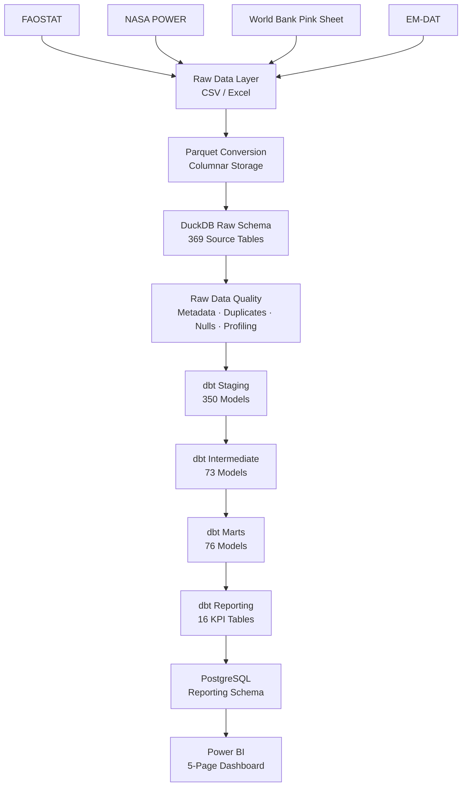

# Global Agriculture Market Intelligence Platform


An end-to-end analytics platform that transforms 20 years of global agriculture data (2001–2020) across 97M+ records into business intelligence for four critical analytical domains: **Food Security**, **Agricultural Productivity**, **Trade Intelligence**, and **Commodity Market Analysis**.

The platform ingests data from FAOSTAT, NASA POWER, the World Bank Pink Sheet, and EM-DAT; validates it at every stage with automated quality checks; and serves pre-computed KPIs to a 5-page Power BI dashboard through a dedicated PostgreSQL serving layer.

---

## Quick Summary

| | |
|---|---|
| 📊 **Dataset** | Global agriculture, commodity, climate, trade, and socioeconomic data (2001–2020) |
| 🌍 **Scope** | 97M+ records · 369 raw tables · 100+ countries |
| ⚙️ **Stack** | DuckDB · dbt · PostgreSQL · Power BI · Python |
| 🧠 **Analysis** | Food security · productivity · trade dependency · commodity markets |
| 📈 **Output** | 5-page Power BI dashboard · 16 KPI reporting models |

---

## Project Objective

This project transforms heterogeneous global agriculture datasets into an analytics platform that supports decision-making across food security, agricultural productivity, trade dependency, and commodity market analysis.

The objective is to:

- Identify countries showing changes in food security conditions
- Analyze agricultural productivity trends and input relationships
- Measure agricultural trade dependency and concentration risks
- Understand commodity price movements and volatility patterns
- Deliver validated KPIs through a production-style BI architecture

The project demonstrates an end-to-end analytics engineering workflow combining data ingestion, quality engineering, dimensional modeling, KPI development, and business intelligence delivery.


## Quick Navigation

- Architecture
- Business Problems
- Key Insights
- Data Quality
- Power BI Architecture
- Repository Structure
- Documentation
- Setup

---

## Architecture Overview



The architecture follows a layered analytics engineering pattern inspired by the medallion approach, where data moves through progressively refined layers. Each layer has a defined responsibility, improving data quality, lineage, and maintainability.

---

## Project Scale

| Metric | Value |
|---|---:|
| Raw Source Tables | 369 |
| Raw Records | 97M+ |
| Staging Models | 350 |
| Intermediate Models | 73 |
| Mart Models | 76 |
| Reporting Models | 16 |
| Dashboard Pages | 5 |
| Analysis Domains | 4 |
| Documentation Files | 7 |
| Data Sources | 4 |
| Year Coverage | 2001–2020 |

---

## Business Problems

The platform addresses analytical questions relevant to agricultural analysts, researchers, and organizations involved in food systems and commodity markets.

### 1. Food Security

> Which countries are becoming food insecure?

**Analytical questions supported:** Which countries show declining food security indicators? Where should analysts investigate further? Which countries are at risk next year?

**Key models:** `fact_food_security__data`, `fact_socioeconomic__population`

### 2. Agricultural Productivity

> Why are some countries producing more than others?

**Analytical questions supported:** How do productivity trends vary across countries? Which agricultural inputs correlate with production outcomes?

**Key models:** `fact_production__crops_livestock`, `fact_land_resources__inputs_fertilizersnutrient`, `fact_land_resources__environment_pesticides`

### 3. Trade Intelligence

> How dependent is each country on imports and exports?

**Analytical questions supported:** Which countries show high import dependency? How concentrated are agricultural trade relationships?

**Key models:** `fact_trade__trade`, `fact_trade__matrix`

### 4. Commodity Market Analysis

> Why are agricultural commodity prices changing?

**Analytical questions supported:** How do commodity prices change over time? Which commodities show higher volatility?

**Key models:** `dim_commodity_prices__prices`, `dim_commodity_prices__indices`, `fact_prices__consumerpriceindices`, `fact_prices__rate`

---

## Key Insights

The platform's analysis of available global agricultural datasets (2001–2020) identified patterns across all four business domains. These findings are analytical observations and should be interpreted alongside domain expertise and external context. These are summarized below; full details are in `docs/06_business_insights_report.md`.

**1. Food security improved on average, but country-level trends varied significantly.** The population-weighted food supply adequacy indicator increased from 1.49 (2001) to 1.64 (2020). The analysis identified countries including Syria, Venezuela, Egypt, and Nigeria among those showing notable negative trends in food security indicators. Trend direction provides additional context beyond absolute levels when identifying countries requiring further investigation.

**2. Wheat yield trends vary substantially across countries.** Iraq (+298%) and Kuwait (+193%) recorded some of the largest increases between 2001 and 2020, while several countries experienced declining yields. These differences highlight the importance of examining country-specific factors such as agricultural investment, resource availability, climate conditions, and policy environment when interpreting productivity changes.

**3. Agricultural trade dependency varies significantly across countries.** The analysis identified differences in import dependency for agricultural inputs, with some countries showing consistently high reliance on imports. Export concentration patterns also highlight countries where trade exposure is concentrated among fewer markets, providing useful signals for diversification analysis.

**4. Fertilizer prices showed the strongest increase among tracked commodity indices.** Fertilizer prices increased by approximately +114% between 2001 and 2020, compared with food (+91%) and overall agriculture (+85%) indices. The analysis highlights how input price movements can influence agricultural production economics. Wheat price volatility peaked at 11.8% in 2010, with additional periods of elevated volatility during the 2007–2008 global food price crisis.

---

## Data Layers

### Raw Layer

The raw layer acts as the platform's ingestion layer. Source datasets from FAOSTAT, NASA POWER, the World Bank, and EM-DAT are stored in their original CSV and Excel formats under `data/raw`, then converted to Parquet for efficient columnar storage and loaded into DuckDB's `raw` schema. No business transformations are applied at this stage — the raw layer preserves the exact structure and content received from each source, providing a complete, auditable record of what the platform ingested.

After ingestion, three automated validation steps establish baseline quality: metadata generation (`make auto-metadata`), data quality checks (`make quality-checks-raw`), and profiling (`make profiling-raw`). Results are stored in the DuckDB `audit` schema and in JSON files under `logs/raw/`. Detailed results are in the [Data Quality](#data-quality) section below.

### Staging Layer

The staging layer cleans and standardizes raw data into a consistent, analysis-ready format without introducing business logic — column name standardization, type casting, and basic cleaning. It includes two specialized sub-layers: `_dedup` for tables with known duplicate records, and `_unpivot` for wide-format datasets (years as columns) converted to long analytical format. Full detail: `docs/01_architecture_report.md` §3.

### Intermediate Layer

The intermediate layer contains 73 reusable transformation models that prevent duplicated logic across the mart layer — complex joins, shared reshaping, and preparation logic used by multiple marts. Not organized around business questions; see `docs/01_architecture_report.md` §3 for detail.

### Mart Layer

The mart layer contains 76 business-oriented analytical models organized around the platform's core domains and supporting subject areas:

| Domain | Sub-Directory | Key Models |
|---|---|---|
| Food Security | `marts/food_security` | `fact_food_security__data`, `fact_food_security__foodbalancesheets` |
| Production | `marts/production` | `fact_production__crops_livestock`, `fact_production__indices` |
| Land Resources | `marts/land_resources` | `fact_land_resources__inputs_fertilizersnutrient`, `fact_land_resources__environment_pesticides` |
| Trade | `marts/trade` | `fact_trade__trade`, `fact_trade__matrix` |
| Prices | `marts/prices` | `fact_prices__consumerpriceindices`, `fact_prices__rate` |
| Commodity Prices | `marts/commodity_prices` | `dim_commodity_prices__prices`, `dim_commodity_prices__indices` |
| Weather | `marts/weather` | `dim_weather` |
| Disasters | `marts/disasters` | `dim_disasters` |
| Socioeconomic | `marts/socioeconomic` | `fact_socioeconomic__population`, `fact_socioeconomic__indicators` |
| Country Reference | `marts/country_reference` | `dim_country_reference` |

Mart models are the "analysis-ready" version of the data — joined, filtered, and organized around business entities such as country, year, commodity, and indicator.

### Reporting Layer

The reporting layer produces 16 dashboard-ready KPI tables that Power BI consumes. These tables are pre-aggregated, lightweight datasets (max ~4,400 rows each) containing exactly the data needed for each dashboard visual:

| Domain | Reporting Models |
|---|---|
| Food Security | `kpi_food_security_adequacy_ratio`, `kpi_food_security_below_threshold`, `kpi_food_security_risk_trend`, `kpi_food_security_undernourishment` |
| Productivity | `kpi_productivity_wheat_yield`, `kpi_productivity_yield_trend`, `kpi_productivity_fertilizer_intensity`, `kpi_productivity_pesticide_intensity` |
| Trade | `kpi_trade_import_dependency`, `kpi_trade_export_concentration`, `kpi_trade_import_diversification`, `kpi_trade_dependency_trend` |
| Commodity | `kpi_prices_volatility`, `kpi_prices_index`, `kpi_prices_cpi_passthrough`, `kpi_prices_fx_effect` |

All KPI calculations, aggregations, rankings, and trend computations are performed in dbt before reaching Power BI. The dashboard's role is strictly visualization and interaction — not computation.

---

## Data Quality

Data quality validation is implemented at two distinct layers using different mechanisms appropriate to each.

### Raw Layer Validation

Python audit scripts run against the DuckDB `raw` schema after ingestion, before any transformation begins:

| Check | Description |
|---|---|
| Row count validation | Confirms each table has expected record volumes |
| Duplicate detection | Identifies fully or partially duplicated rows |
| Null analysis | Measures columns with NULL values and their prevalence |
| Profiling statistics | Captures column counts, data types, and distribution characteristics |
| Outlier detection | Flags numeric columns with statistically unusual values |
| Constant column detection | Flags columns where every value is identical |

**Current status:** 366 of 369 raw tables passed their latest quality run (99.2% pass rate). 3 tables failed due to duplicate rows in reference tables (`foodbalancesheets_areacodes`, `foodbalancesheetshistoric_areacodes`, `forestry_trade_flows_areacodes`). These failures are documented and handled through dedicated cleaning models where required.

### Transformation Layer Validation

dbt tests are applied at every transformation layer — staging, intermediate, and marts:

| Test Type | What It Validates |
|---|---|
| `not_null` | Critical columns (area_code, year, item_code) contain no NULLs |
| `unique` | Primary key columns have no duplicate values |
| `relationships` | Foreign key relationships between fact and dimension tables are valid |
| `accepted_values` | Categorical columns contain only expected values |
| `dbt_utils.accepted_range` | Numeric values fall within expected ranges |

### Reporting Layer Validation

KPI notebooks validate that reporting models produce correct results by confirming item/element string matches and expected year coverage, raising explicit errors if required data returns zero rows, logging row counts and distinct-country counts at each step, and spot-checking aggregations against manual calculations.

---

## Dashboard Preview

The Power BI dashboard contains 5 analytical pages:

### 01 — Executive Overview


### 02 — Food Security


### 03 — Agricultural Productivity


### 04 — Trade Intelligence


### 05 — Commodity Prices


Dashboard documentation:
`docs/05_powerbi_explanation.md`

---

## Power BI Architecture

Power BI does **not** directly connect to raw data, DuckDB analytical tables, or any dbt staging/intermediate/mart model. It connects exclusively to a dedicated PostgreSQL serving database (`make export` → PostgreSQL `reporting` schema → Power BI Import Mode).

This separation gives better dashboard performance, centralized/version-controlled business logic, and a stable serving contract. Full rationale: `docs/01_architecture_report.md` §7.

---

## Notebook Architecture

Jupyter notebooks serve as an exploratory and validation layer — they are **not** part of the production pipeline and do not directly feed Power BI.

### Exploration Notebooks (01–05)

Used after raw data preparation to understand dataset structures, available indicators, data coverage, quality issues, and initial relationships between variables.

| Notebook | Purpose |
|---|---|
| `01_dataset_metadata_review` | Review auto-generated metadata for all raw tables |
| `02_data_quality_review` | Analyze data quality check results |
| `03_data_profiling_review` | Review profiling statistics and outlier detection |
| `04_raw_data_exploration` | Direct exploration of raw datasets |
| `05_data_cleaning_plan` | Document cleaning requirements for staging |

### Analysis Notebooks (11–42)

Used with dbt analytical models to validate business metrics, investigate KPIs, and prepare insights for the Business Insights Report.

| Notebook | Purpose |
|---|---|
| `11_food_security_analysis` | Food security business question investigation |
| `12_food_security_analysis_kpi` | Food security KPI calculation and validation |
| `21_productivity_analysis` | Agricultural productivity investigation |
| `22_productivity_analysis_kpi` | Productivity KPI validation |
| `31_trade_intelligence_analysis` | Trade intelligence investigation |
| `32_trade_intelligence_analysis_kpi` | Trade KPI validation |
| `41_commodity_market_analysis` | Commodity market investigation |
| `42_commodity_market_analysis_kpi` | Commodity KPI validation |

Validated analytical logic from notebooks is translated into dbt reporting models where required for production reporting. for production use, ensuring reproducibility and consistency.

---

## Technology Stack

| Layer | Technology | Why |
|---|---|---|
| Analytical Database | DuckDB | Serverless columnar engine with native Parquet support; zero-configuration embedded execution ideal for analytical workloads at this scale |
| Transformation | dbt Core + dbt-duckdb | Version-controlled, testable SQL transformations with automatic DAG dependency management; dbt-duckdb adapter for direct DuckDB execution |
| Programming | Python | Data acquisition, ingestion, quality checks, profiling, and model generation scripts |
| Data Processing | Parquet | Columnar storage with better compression and faster analytical reads than CSV/Excel |
| Serving Database | PostgreSQL | Production-grade serving layer that decouples Power BI from the analytical engine; native Power BI connector support |
| Visualization | Power BI | Pre-aggregated Import mode dashboard with 5 pages covering all four business domains |
| Pipeline Execution | Makefile | Declarative, dependency-aware command orchestration with clear documentation of all pipeline steps |
| Analysis | Jupyter Notebook | Exploratory analysis and KPI validation during development; not part of production pipeline |

---

## Repository Structure

```
global-agricultural-market-intelligence-pvt/
├── data/
│   └── raw/                              # Source data files (CSV, Excel)
├── src/
│   ├── ingest/                           # Data ingestion loaders (FAOSTAT, NASA, EM-DAT, etc.)
│   ├── data_quality/                     # Raw data quality checking
│   │   └── checks/                       # Individual check modules (duplicates, missing, schema, values)
│   ├── profiling/                        # Raw data profiling
│   │   └── checks/                       # Profiling modules (categorical, correlations, distributions, outliers, statistics)
│   ├── export/                           # PostgreSQL export logic
│   ├── extract/                          # External data download (NASA POWER)
│   ├── generate/                         # Data generation (holiday calendars)
│   ├── audit/                            # Audit and cleanup management
│   ├── database/                         # DuckDB connection and discovery
│   ├── tests/                            # Connection and integration tests
│   └── utils/                            # Utility scripts (Parquet conversion, model generators, metadata)
├── dbt/
│   └── agriculture/
│       └── models/
│           ├── staging/                  # 350 staging models
│           ├── intermediate/             # 73 intermediate models
│           ├── marts/                    # 76 mart models (domain sub-directories)
│           └── reporting/                # 16 KPI reporting models
├── notebook/                             # Jupyter notebooks (exploration + analysis)
├── dashboards/                           # Power BI dashboard files
├── docs/                                 # Project documentation (7 files)
├── metadata/
│   ├── auto_metadata/                    # Auto-generated table metadata (JSON)
│   ├── data_dictionary/                  # Auto-generated data dictionary (Markdown)
│   └── manual_metadata/                  # Manually maintained metadata
├── logs/
│   └── raw/
│       ├── data_quality/                 # Quality check results (JSON)
│       └── profiling/                    # Profiling results (JSON)
├── Makefile                              # Pipeline orchestration
├── environment.yml                       # Conda environment specification
└── requirements.txt                      # Python package dependencies
```

---

## Documentation

| Document | Purpose |
|---|---|
| [01_architecture_report.md](docs/01_architecture_report.md) | Complete technical architecture explanation |
| [02_data_dictionary.md](docs/02_data_dictionary.md) | Auto-generated documentation covering raw tables and transformed models |
| [03_data_quality_report.md](docs/03_data_quality_report.md) | Raw data quality validation results and recommendations |
| [04_data_pipeline_workflow.md](docs/04_data_pipeline_workflow.md) | Step-by-step pipeline execution workflow |
| [05_powerbi_explanation.md](docs/05_powerbi_explanation.md) | Power BI dashboard architecture, KPI definitions, and page descriptions |
| [06_business_insights_report.md](docs/06_business_insights_report.md) | Business findings and recommendations across all four domains |
| [07_analysis_assumptions_and_limitations.md](docs/07_analysis_assumptions_and_limitations.md) | Data limitations, known issues, and validation methodology |

---

## Getting Started

### Prerequisites

- Python 3.11
- Conda (Miniconda or Anaconda)
- PostgreSQL (for BI serving layer)
- Power BI Desktop (for dashboard)
- dbt Core 1.8.0

### Environment Setup

```bash
# Clone the repository
git clone <repository-url>
cd global-agricultural-market-intelligence-pvt

# Create the conda environment
conda env create -f environment.yml
conda activate global-agricultural-market-intelligence

# Install Python dependencies
pip install -r requirements.txt
```

### Pipeline Execution

```bash
# 1. Place source data files in data/raw/

# 2. Generate additional datasets
make generate-holidays
make download-weather

# 3. Convert source files to Parquet
make convert

# 4. Ingest into DuckDB
make ingest

# 5. Generate raw metadata and validate quality
make auto-metadata
make quality-checks-raw
make profiling-raw

# 6. Generate dbt models
generate_all_staging_models
make generate-dedup-models TABLES="foodbalancesheets_areacodes foodbalancesheetshistoric_areacodes forestry_trade_flows_areacodes"
generate_unpivot_models
make generate-sources-yml

# 7. Configure dbt profile
# Update ~/.dbt/profiles.yml with your DuckDB connection settings

# 8. Run dbt transformations
dbt deps
dbt run
dbt test

# 9. Generate intermediate models
make generate-intermediate-models

# 10. Run dbt layer by layer
dbt run --select staging
dbt test --select staging
dbt run --select intermediate
dbt test --select intermediate
dbt run --select marts
dbt test --select marts
dbt run --select reporting

# 11. Export reporting tables to PostgreSQL
make export

# 12. Connect Power BI to PostgreSQL reporting schema
```

### Power BI Connection

1. Install the [PostgreSQL ODBC connector](https://www.postgresql.org/ftp/odbc/versions/msi/)
2. In Power BI Desktop: **Get Data → PostgreSQL database**
3. Set server to `localhost:5432`, select **Import** mode
4. Load all 16 tables from the `reporting` schema

---

## Skills Demonstrated

| Skill | How This Project Demonstrates It |
|---|---|
| End-to-end analytics engineering | Full pipeline from raw CSV ingestion to Power BI dashboard delivery |
| DuckDB analytical architecture | 369-table raw schema, multi-layer transformation, audit schema for quality tracking |
| Data quality engineering | Multi-layer validation: Python audit scripts for raw data, dbt tests for transformations, notebook validation for KPIs |
| Metadata automation | Auto-generated metadata, data dictionary, and quality reports from DuckDB schema inspection |
| KPI engineering | 16 business KPIs computed in dbt, validated in notebooks, served through PostgreSQL |
| BI serving architecture | Dedicated PostgreSQL serving layer that decouples Power BI from the analytical engine |
| Business analytics | Four business domains with decision-support KPIs, trend analysis, and country-level rankings |
| dbt transformation modeling | 515 SQL models organized across staging, intermediate, marts, and reporting layers with testing and dependency management |

---

## Lessons Learned

**Separating the analytical and BI layers is worth the extra step.** Initially, connecting Power BI directly to DuckDB seemed simpler. In practice, exporting reporting tables to PostgreSQL provided a stable, predictable serving layer that insulated the dashboard from analytical schema changes and eliminated performance concerns during dashboard refresh. The PostgreSQL `reporting` schema acts as a fixed contract between the data platform and the BI layer.

**KPI logic is better maintained in dbt rather than embedded only in Power BI.** Early in the project, some metric calculations were prototyped as DAX measures inside Power BI. This made them invisible to version control, untestable, and difficult to debug. Moving all KPI logic into dbt reporting models meant every metric was version-controlled, testable, and independently auditable. Power BI's role became strictly visualization — any metric shown on the dashboard is traceable to a specific dbt model.

**Automated metadata generation scales where manual documentation cannot.** With 369 raw tables and 515 dbt models, maintaining a data dictionary by hand is impractical. The `make auto-metadata` command generates metadata directly from the DuckDB schema, and the data dictionary is produced programmatically from that metadata. This ensures documentation stays in sync with the actual database state, even as tables are added or modified.

**Validation before consumption prevents downstream errors from compounding.** The multi-layer validation approach (raw quality checks → dbt staging tests → intermediate tests → mart tests → KPI notebook validation) catches issues early. The 3 duplicate-row failures detected in raw reference tables were caught before they could propagate into staging models, and the KPI notebooks' guard checks prevent silent failures where a required item/element combination returns zero rows.

**Wide-format source data requires early unpivoting.** Several FAOSTAT datasets provide years as columns (Y2001, Y2002, ...), which is incompatible with analytical queries and joins. Handling this in a dedicated `_unpivot` staging sub-layer, rather than in each downstream model individually, kept the transformation logic clean and prevented duplicated unpivot operations across the mart layer.

---

## Data Sources

| Source | Data Type | Access |
|---|---|---|
| FAOSTAT | Agricultural production, trade, food balance, land use, emissions, prices | Web download |
| NASA POWER | Rainfall and temperature time series | API (no key required) |
| World Bank Pink Sheet | Commodity and fuel prices | Excel download |
| EM-DAT | Natural disaster records | Bulk export (registration required) |

---

## License

This project is for educational and portfolio demonstration purposes. Data sourced from FAOSTAT, NASA, the World Bank, and EM-DAT is subject to their respective terms of use.

---

## Full Project Availability

This repository showcases the core architecture, methodology, and selected outputs of the project.

The complete implementation is maintained in a private repository because it contains proprietary work, large datasets, or materials that cannot be shared publicly.

Recruiters and hiring managers interested in reviewing the full project may contact me via LinkedIn or email to arrange access or a walkthrough.
